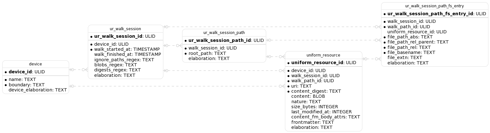
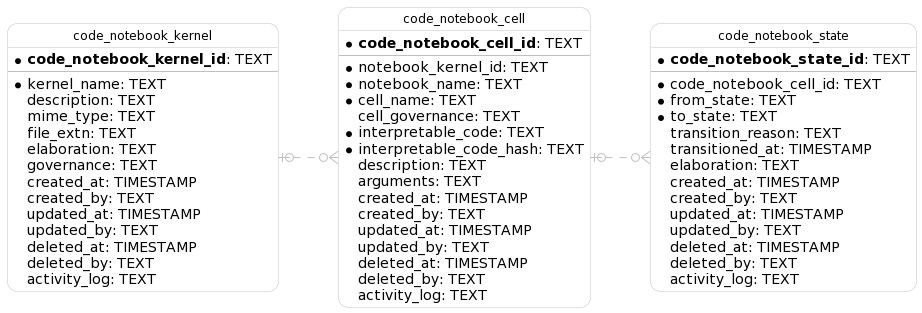

# `surveilr` Resource Surveillance

This Rust-based project is an extendable file system inspector for performing
surveillance of machine resources. It is used to walk resources like file
systems and generate an SQLite database which can then be consumed by any
computing environment that supports SQLite.

## Installation

You can install the latest `surveilr` using either of the following one-liners:

```bash
$ curl -sL https://raw.githubusercontent.com/opsfolio/resource-surveillance/main/install.sh | sh

# if you want a different install path
$ SURVEILR_HOME="$HOME/bin" curl -sL https://raw.githubusercontent.com/opsfolio/resource-surveillance/main/install.sh | sh
```

If you use `eget`:

```bash
$ eget opsfolio/resource-surveillance --asset tar.gz
```

## Usage

```bash
$ ./surveilr --help                         # get CLI help
$ ./surveilr fs-walk                        # walk the current working directory (CWD)
$ ./surveilr fs-walk -r /other -r /other2   # walk some other director(ies)
$ ./surveilr fs-walk --stats                # walk the current working directory (CWD) show stats afterwards
```

Other use cases:

```bash
$ ./surveilr notebooks ls                                     # list all notebooks and cells available, with migrations status
$ ./surveilr notebooks cat --cell notebooksInfoSchemaDiagram  # show the notebooks admin PlanUML ERD stored in the database
$ ./surveilr notebooks cat --cell surveilrInfoSchemaDiagram   # show the surveilr PlanUML ERD stored in the database
$ ./surveilr --completions fish | source                      # setup completions to reduce typing
```

See [CLI Help](CLI-help.md) for details.

## Architecture



Device Uniform Resource ER Diagram (generated from
`./surveilr notebooks cat --cell surveilrInfoSchemaDiagram`) without
housekeeping columns:



Administrative Code Notebooks ER Diagram (generated from
`./surveilr notebooks cat --cell notebooksInfoSchemaDiagram`):



## Development

**IMPORTANT**: Use SQLa to generate all SQL so it's portable but use Rusqlite to
make working with SQLite more ergonomic. Remember to only use libraries to help
improve developer productivity, always assume SQLite database will be used
across polyglot programming environments so SQL code should be transparent and
portable.

Development prerequisites:

- Install Rust toolchain (1.73 or above, best to use `rustup`, `asdf` or `rtx`
  for multiple simultaneous versions)
- `cargo install just` so we can use `Justfile` for task management

Regular use:

```bash
$ just --completions fish | source            # setup completions to reduce typing

$ just test                                   # run unit tests with cargo nextest

$ just run                                    # get CLI help
$ cargo run -- --help                         # get CLI help, same as above

$ just run admin cli-help-md                  # get CLI in Markdown and update this README.md manually
$ cargo run -- --help-markdown > CLI-help.md  # get CLI in Markdown, same as above

$ just run fs-walk --help                     # get CLI help for fs-walk subcommand
$ just run --debug fs-walk                    # walk the current working directory (CWD) with debug messages
$ just run fs-walk -r /other -r /other2       # walk some other director(ies)
$ just run fs-walk -i .git/                   # walk CWD, ignore .git/ paths
$ just run fs-walk -i .git/ -i target/        # walk CWD, ignore .git/ and target/ paths

$ just sqla-sync                              # generate SQLa bootstrap and other SQL
                                             
$ just dev                                    # turn on auto-compile, auto-run during development
                                              # using cargo-watch command
```
