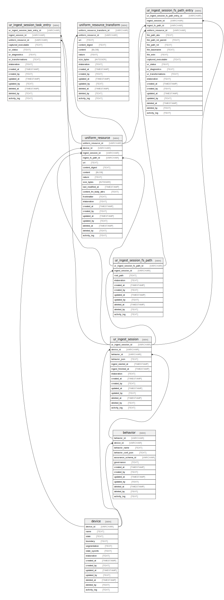

# Resource Surveillance State Schema

## Tables

| Name                                                              | Columns | Comment                                                                                                                                                                                                                                                                                                                                                                                                                                                                                                                                                | Type  |
| ----------------------------------------------------------------- | ------- | ------------------------------------------------------------------------------------------------------------------------------------------------------------------------------------------------------------------------------------------------------------------------------------------------------------------------------------------------------------------------------------------------------------------------------------------------------------------------------------------------------------------------------------------------------ | ----- |
| [device](device.md)                                               | 14      | Identity, network segmentation, and sysinfo for devices on which uniform_resource are found                                                                                                                                                                                                                                                                                                                                                                                                                                                            | table |
| [behavior](behavior.md)                                           | 13      | Behaviors are configuration "presets" that can be used to drive application operations at runtime. For example FS Walk behaviors include configs that indicate which files to ignore, which to scan, when to load content, etc. This is more convenient than  creating   behavior has a foreign key reference to the device table since behaviors might be device-specific.                                                                                                                                                       | table |
| [ur_walk_session](ur_walk_session.md)                             | 14      | Immutable Walk Sessions represents any "discovery" or "walk" operation.  This could be a device file system scan or any other resource discovery  session. Each time a discovery operation starts, a record is created.   ur_walk_session has a foreign key reference to the device table so that the  same device can be used for multiple walk sessions but also the walk  sessions can be merged across workstations / servers for easier detection  of changes and similaries between file systems on different devices.                           | table |
| [ur_walk_session_path](ur_walk_session_path.md)                   | 11      | Immutable Walk Session path represents a discovery or "walk" path If the session was file system scan, then root_path is the root file system path that was scanned. If the session was discovering resources in another target then root_path would be representative of the target path (could be a URI).                                                                                                                                                                                                                                | table |
| [uniform_resource](uniform_resource.md)                           | 20      | Immutable resource and content information. On multiple executions, uniform_resource are inserted only if the the content (see unique  index for details). For historical logging, uniform_resource has foreign key references to both ur_walk_session and ur_walk_session_path tables to indicate which particular session and walk path the resourced was inserted during.                                                                                                                                                            | table |
| [uniform_resource_transform](uniform_resource_transform.md)       | 15      | uniform_resource transformed content                                                                                                                                                                                                                                                                                                                                                                                                                                                                                                                   | table |
| [ur_walk_session_path_fs_entry](ur_walk_session_path_fs_entry.md) | 21      | Contains entries related to file system content walk paths. On multiple executions,  unlike uniform_resource, ur_walk_session_path_fs_entry rows are always inserted and   references the uniform_resource primary key of its related content.  This method allows for a more efficient query of file version differences across  sessions. With SQL queries, you can detect which sessions have a file added or modified,   which sessions have a file deleted, and what the differences are in file contents  if they were modified across sessions. | table |

## Relations

---

> Generated by [tbls](https://github.com/k1LoW/tbls)
