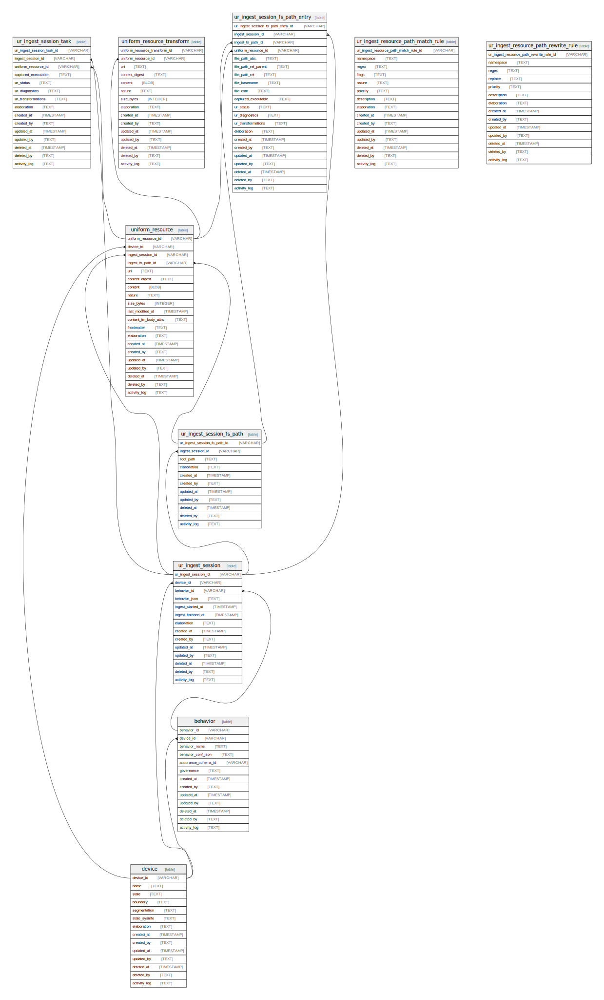

# Resource Surveillance State Schema

## Tables

| Name                                                                            | Columns | Comment | Type  |
| ------------------------------------------------------------------------------- | ------- | ------- | ----- |
| [sqlpage_files](sqlpage_files.md)                                               | 3       |         | table |
| [device](device.md)                                                             | 14      |         | table |
| [ur_walk_session](ur_walk_session.md)                                           | 15      |         | table |
| [ur_walk_session_path](ur_walk_session_path.md)                                 | 11      |         | table |
| [uniform_resource](uniform_resource.md)                                         | 20      |         | table |
| [ur_walk_session_path_fs_entry](ur_walk_session_path_fs_entry.md)               | 17      |         | table |
| [fs_content_walk_session_stats_latest](fs_content_walk_session_stats_latest.md) | 15      |         | view  |
| [fs_content_walk_session_stats](fs_content_walk_session_stats.md)               | 15      |         | view  |

## Relations

---

> Generated by [tbls](https://github.com/k1LoW/tbls)
