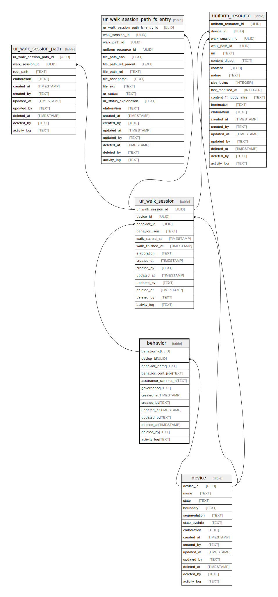

# behavior

## Description

Behaviors are configuration "presets" that can be used to drive  
application operations at runtime. For example, ingest behaviors  
include configs that indicate which files to ignore, which to  
scan, when to load content, etc. This is more convenient than   
creating   
  
behavior has a foreign key reference to the device table since  
behaviors might be device-specific.

<details>
<summary><strong>Table Definition</strong></summary>

```sql
CREATE TABLE "behavior" (
    "behavior_id" ULID PRIMARY KEY NOT NULL,
    "device_id" ULID NOT NULL,
    "behavior_name" TEXT NOT NULL,
    "behavior_conf_json" TEXT CHECK(json_valid(behavior_conf_json)) NOT NULL,
    "assurance_schema_id" TEXT,
    "governance" TEXT CHECK(json_valid(governance) OR governance IS NULL),
    "created_at" TIMESTAMP DEFAULT CURRENT_TIMESTAMP,
    "created_by" TEXT DEFAULT 'UNKNOWN',
    "updated_at" TIMESTAMP,
    "updated_by" TEXT,
    "deleted_at" TIMESTAMP,
    "deleted_by" TEXT,
    "activity_log" TEXT,
    FOREIGN KEY("device_id") REFERENCES "device"("device_id"),
    FOREIGN KEY("assurance_schema_id") REFERENCES "assurance_schema"("assurance_schema_id"),
    UNIQUE("device_id", "behavior_name")
)
```

</details>

## Columns

| Name                | Type      | Default           | Nullable | Children                                  | Parents             | Comment                                                                                      |
| ------------------- | --------- | ----------------- | -------- | ----------------------------------------- | ------------------- | -------------------------------------------------------------------------------------------- |
| behavior_id         | ULID      |                   | false    | [ur_ingest_session](ur_ingest_session.md) |                     | {"isSqlDomainZodDescrMeta":true,"isUlid":true}                                               |
| device_id           | ULID      |                   | false    |                                           | [device](device.md) | {"isSqlDomainZodDescrMeta":true,"isUlid":true}                                               |
| behavior_name       | TEXT      |                   | false    |                                           |                     | Arbitrary but unique per-device behavior name (e.g. ingest::xyz)                             |
| behavior_conf_json  | TEXT      |                   | false    |                                           |                     | Configuration, settings, parameters, etc. describing the behavior (JSON, behavior-dependent) |
| assurance_schema_id | TEXT      |                   | true     |                                           |                     |                                                                                              |
| governance          | TEXT      |                   | true     |                                           |                     | Descriptions or other "governance" details (JSON, behavior-dependent)                        |
| created_at          | TIMESTAMP | CURRENT_TIMESTAMP | true     |                                           |                     |                                                                                              |
| created_by          | TEXT      | 'UNKNOWN'         | true     |                                           |                     |                                                                                              |
| updated_at          | TIMESTAMP |                   | true     |                                           |                     |                                                                                              |
| updated_by          | TEXT      |                   | true     |                                           |                     |                                                                                              |
| deleted_at          | TIMESTAMP |                   | true     |                                           |                     |                                                                                              |
| deleted_by          | TEXT      |                   | true     |                                           |                     |                                                                                              |
| activity_log        | TEXT      |                   | true     |                                           |                     | {"isSqlDomainZodDescrMeta":true,"isJsonSqlDomain":true}                                      |

## Constraints

| Name                        | Type        | Definition                                                                                                                             |
| --------------------------- | ----------- | -------------------------------------------------------------------------------------------------------------------------------------- |
| behavior_id                 | PRIMARY KEY | PRIMARY KEY (behavior_id)                                                                                                              |
| - (Foreign key ID: 0)       | FOREIGN KEY | FOREIGN KEY (assurance_schema_id) REFERENCES assurance_schema (assurance_schema_id) ON UPDATE NO ACTION ON DELETE NO ACTION MATCH NONE |
| - (Foreign key ID: 1)       | FOREIGN KEY | FOREIGN KEY (device_id) REFERENCES device (device_id) ON UPDATE NO ACTION ON DELETE NO ACTION MATCH NONE                               |
| sqlite_autoindex_behavior_2 | UNIQUE      | UNIQUE (device_id, behavior_name)                                                                                                      |
| sqlite_autoindex_behavior_1 | PRIMARY KEY | PRIMARY KEY (behavior_id)                                                                                                              |
| -                           | CHECK       | CHECK(json_valid(behavior_conf_json))                                                                                                  |
| -                           | CHECK       | CHECK(json_valid(governance) OR governance IS NULL)                                                                                    |

## Indexes

| Name                        | Definition                        |
| --------------------------- | --------------------------------- |
| sqlite_autoindex_behavior_2 | UNIQUE (device_id, behavior_name) |
| sqlite_autoindex_behavior_1 | PRIMARY KEY (behavior_id)         |

## Relations



---

> Generated by [tbls](https://github.com/k1LoW/tbls)
