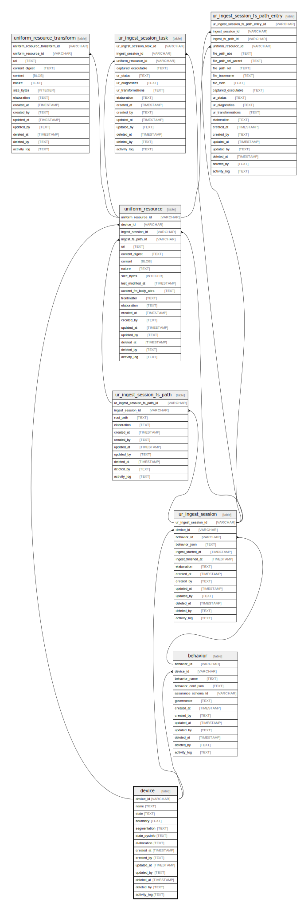

# device

## Description

<details>
<summary><strong>Table Definition</strong></summary>

```sql
CREATE TABLE "device" (
    "device_id" ULID PRIMARY KEY NOT NULL,
    "name" TEXT NOT NULL,
    "state" TEXT CHECK(json_valid(state)) NOT NULL,
    "boundary" TEXT NOT NULL,
    "segmentation" TEXT CHECK(json_valid(segmentation) OR segmentation IS NULL),
    "state_sysinfo" TEXT CHECK(json_valid(state_sysinfo) OR state_sysinfo IS NULL),
    "elaboration" TEXT CHECK(json_valid(elaboration) OR elaboration IS NULL),
    "created_at" TIMESTAMP DEFAULT CURRENT_TIMESTAMP,
    "created_by" TEXT DEFAULT 'UNKNOWN',
    "updated_at" TIMESTAMP,
    "updated_by" TEXT,
    "deleted_at" TIMESTAMP,
    "deleted_by" TEXT,
    "activity_log" TEXT,
    UNIQUE("name", "state", "boundary")
)
```

</details>

## Columns

| Name          | Type      | Default           | Nullable | Children                                                                      | Comment                                                 |
| ------------- | --------- | ----------------- | -------- | ----------------------------------------------------------------------------- | ------------------------------------------------------- |
| device_id     | ULID      |                   | false    | [ur_walk_session](ur_walk_session.md) [uniform_resource](uniform_resource.md) | {"isSqlDomainZodDescrMeta":true,"isUlid":true}          |
| name          | TEXT      |                   | false    |                                                                               |                                                         |
| state         | TEXT      |                   | false    |                                                                               | {"isSqlDomainZodDescrMeta":true,"isJsonText":true}      |
| boundary      | TEXT      |                   | false    |                                                                               |                                                         |
| segmentation  | TEXT      |                   | true     |                                                                               | {"isSqlDomainZodDescrMeta":true,"isJsonText":true}      |
| state_sysinfo | TEXT      |                   | true     |                                                                               | {"isSqlDomainZodDescrMeta":true,"isJsonText":true}      |
| elaboration   | TEXT      |                   | true     |                                                                               | {"isSqlDomainZodDescrMeta":true,"isJsonText":true}      |
| created_at    | TIMESTAMP | CURRENT_TIMESTAMP | true     |                                                                               |                                                         |
| created_by    | TEXT      | 'UNKNOWN'         | true     |                                                                               |                                                         |
| updated_at    | TIMESTAMP |                   | true     |                                                                               |                                                         |
| updated_by    | TEXT      |                   | true     |                                                                               |                                                         |
| deleted_at    | TIMESTAMP |                   | true     |                                                                               |                                                         |
| deleted_by    | TEXT      |                   | true     |                                                                               |                                                         |
| activity_log  | TEXT      |                   | true     |                                                                               | {"isSqlDomainZodDescrMeta":true,"isJsonSqlDomain":true} |

## Constraints

| Name                      | Type        | Definition                                                |
| ------------------------- | ----------- | --------------------------------------------------------- |
| device_id                 | PRIMARY KEY | PRIMARY KEY (device_id)                                   |
| sqlite_autoindex_device_2 | UNIQUE      | UNIQUE (name, state, boundary)                            |
| sqlite_autoindex_device_1 | PRIMARY KEY | PRIMARY KEY (device_id)                                   |
| -                         | CHECK       | CHECK(json_valid(state))                                  |
| -                         | CHECK       | CHECK(json_valid(segmentation) OR segmentation IS NULL)   |
| -                         | CHECK       | CHECK(json_valid(state_sysinfo) OR state_sysinfo IS NULL) |
| -                         | CHECK       | CHECK(json_valid(elaboration) OR elaboration IS NULL)     |

## Indexes

| Name                      | Definition                                                          |
| ------------------------- | ------------------------------------------------------------------- |
| idx_device__name__state   | CREATE INDEX "idx_device__name__state" ON "device"("name", "state") |
| sqlite_autoindex_device_2 | UNIQUE (name, state, boundary)                                      |
| sqlite_autoindex_device_1 | PRIMARY KEY (device_id)                                             |

## Relations



---

> Generated by [tbls](https://github.com/k1LoW/tbls)
