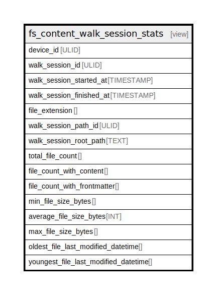

# fs_content_walk_session_stats

## Description

<details>
<summary><strong>Table Definition</strong></summary>

```sql
CREATE VIEW "fs_content_walk_session_stats" AS
    WITH Summary AS (
        SELECT
            device.device_id AS device_id,
            ur_walk_session.ur_walk_session_id AS walk_session_id,
            ur_walk_session.walk_started_at AS walk_session_started_at,
            ur_walk_session.walk_finished_at AS walk_session_finished_at,
            COALESCE(ur_walk_session_path_fs_entry.file_extn, '') AS file_extension,
            ur_walk_session_path.ur_walk_session_path_id as walk_session_path_id,
            ur_walk_session_path.root_path AS walk_session_root_path,
            COUNT(ur_walk_session_path_fs_entry.uniform_resource_id) AS total_file_count,
            SUM(CASE WHEN uniform_resource.content IS NOT NULL THEN 1 ELSE 0 END) AS file_count_with_content,
            SUM(CASE WHEN uniform_resource.frontmatter IS NOT NULL THEN 1 ELSE 0 END) AS file_count_with_frontmatter,
            MIN(uniform_resource.size_bytes) AS min_file_size_bytes,
            AVG(uniform_resource.size_bytes) AS average_file_size_bytes,
            MAX(uniform_resource.size_bytes) AS max_file_size_bytes,
            MIN(uniform_resource.last_modified_at) AS oldest_file_last_modified_datetime,
            MAX(uniform_resource.last_modified_at) AS youngest_file_last_modified_datetime
        FROM
            ur_walk_session
        JOIN
            device ON ur_walk_session.device_id = device.device_id
        LEFT JOIN
            ur_walk_session_path ON ur_walk_session.ur_walk_session_id = ur_walk_session_path.walk_session_id
        LEFT JOIN
            ur_walk_session_path_fs_entry ON ur_walk_session_path.ur_walk_session_path_id = ur_walk_session_path_fs_entry.walk_path_id
        LEFT JOIN
            uniform_resource ON ur_walk_session_path_fs_entry.uniform_resource_id = uniform_resource.uniform_resource_id
        GROUP BY
            device.device_id,
            ur_walk_session.ur_walk_session_id,
            ur_walk_session.walk_started_at,
            ur_walk_session.walk_finished_at,
            ur_walk_session_path_fs_entry.file_extn,
            ur_walk_session_path.root_path
    )
    SELECT
        device_id,
        walk_session_id,
        walk_session_started_at,
        walk_session_finished_at,
        file_extension,
        walk_session_path_id,
        walk_session_root_path,
        total_file_count,
        file_count_with_content,
        file_count_with_frontmatter,
        min_file_size_bytes,
        CAST(ROUND(average_file_size_bytes) AS INTEGER) AS average_file_size_bytes,
        max_file_size_bytes,
        oldest_file_last_modified_datetime,
        youngest_file_last_modified_datetime
    FROM
        Summary
    ORDER BY
        device_id,
        walk_session_finished_at,
        file_extension
```

</details>

## Referenced Tables

- [ur_walk_session](ur_walk_session.md)
- [device](device.md)
- [ur_walk_session_path](ur_walk_session_path.md)
- [ur_walk_session_path_fs_entry](ur_walk_session_path_fs_entry.md)
- [uniform_resource](uniform_resource.md)

## Columns

| Name                                 | Type      | Default | Nullable | Comment |
| ------------------------------------ | --------- | ------- | -------- | ------- |
| device_id                            | ULID      |         | true     |         |
| walk_session_id                      | ULID      |         | true     |         |
| walk_session_started_at              | TIMESTAMP |         | true     |         |
| walk_session_finished_at             | TIMESTAMP |         | true     |         |
| file_extension                       |           |         | true     |         |
| walk_session_path_id                 | ULID      |         | true     |         |
| walk_session_root_path               | TEXT      |         | true     |         |
| total_file_count                     |           |         | true     |         |
| file_count_with_content              |           |         | true     |         |
| file_count_with_frontmatter          |           |         | true     |         |
| min_file_size_bytes                  |           |         | true     |         |
| average_file_size_bytes              | INT       |         | true     |         |
| max_file_size_bytes                  |           |         | true     |         |
| oldest_file_last_modified_datetime   |           |         | true     |         |
| youngest_file_last_modified_datetime |           |         | true     |         |

## Relations



---

> Generated by [tbls](https://github.com/k1LoW/tbls)
