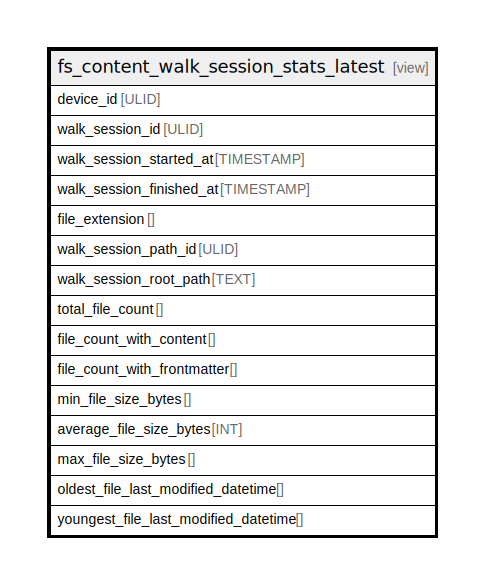

# fs_content_walk_session_stats_latest

## Description

<details>
<summary><strong>Table Definition</strong></summary>

```sql
CREATE VIEW "fs_content_walk_session_stats_latest" AS
    SELECT fs.*
      FROM fs_content_walk_session_stats AS fs
      JOIN (  SELECT ur_walk_session.ur_walk_session_id AS latest_session_id
                FROM ur_walk_session
            ORDER BY ur_walk_session.walk_finished_at DESC
               LIMIT 1) AS latest
        ON fs.walk_session_id = latest.latest_session_id
```

</details>

## Referenced Tables

- [fs_content_walk_session_stats](fs_content_walk_session_stats.md)
- [ur_walk_session](ur_walk_session.md)

## Columns

| Name                                 | Type      | Default | Nullable | Comment |
| ------------------------------------ | --------- | ------- | -------- | ------- |
| device_id                            | ULID      |         | true     |         |
| walk_session_id                      | ULID      |         | true     |         |
| walk_session_started_at              | TIMESTAMP |         | true     |         |
| walk_session_finished_at             | TIMESTAMP |         | true     |         |
| file_extension                       |           |         | true     |         |
| walk_session_path_id                 | ULID      |         | true     |         |
| walk_session_root_path               | TEXT      |         | true     |         |
| total_file_count                     |           |         | true     |         |
| file_count_with_content              |           |         | true     |         |
| file_count_with_frontmatter          |           |         | true     |         |
| min_file_size_bytes                  |           |         | true     |         |
| average_file_size_bytes              | INT       |         | true     |         |
| max_file_size_bytes                  |           |         | true     |         |
| oldest_file_last_modified_datetime   |           |         | true     |         |
| youngest_file_last_modified_datetime |           |         | true     |         |

## Relations



---

> Generated by [tbls](https://github.com/k1LoW/tbls)
