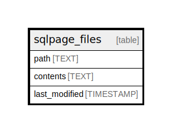

# sqlpage_files

## Description

<details>
<summary><strong>Table Definition</strong></summary>

```sql
CREATE TABLE "sqlpage_files" (
    "path" TEXT PRIMARY KEY NOT NULL,
    "contents" TEXT NOT NULL,
    "last_modified" TIMESTAMP DEFAULT CURRENT_TIMESTAMP
)
```

</details>

## Columns

| Name          | Type      | Default           | Nullable | Comment |
| ------------- | --------- | ----------------- | -------- | ------- |
| path          | TEXT      |                   | false    |         |
| contents      | TEXT      |                   | false    |         |
| last_modified | TIMESTAMP | CURRENT_TIMESTAMP | true     |         |

## Constraints

| Name                             | Type        | Definition         |
| -------------------------------- | ----------- | ------------------ |
| path                             | PRIMARY KEY | PRIMARY KEY (path) |
| sqlite_autoindex_sqlpage_files_1 | PRIMARY KEY | PRIMARY KEY (path) |

## Indexes

| Name                             | Definition         |
| -------------------------------- | ------------------ |
| sqlite_autoindex_sqlpage_files_1 | PRIMARY KEY (path) |

## Relations



---

> Generated by [tbls](https://github.com/k1LoW/tbls)
