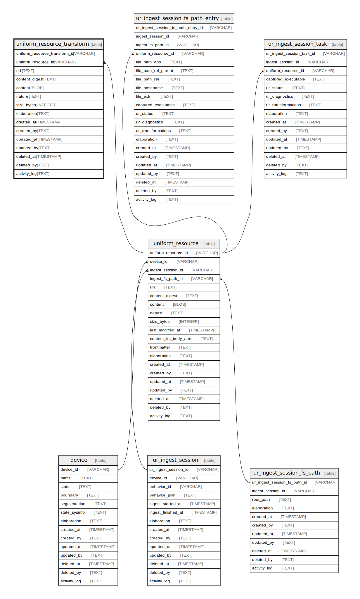

# uniform_resource_transform

## Description

uniform_resource transformed content

<details>
<summary><strong>Table Definition</strong></summary>

```sql
CREATE TABLE "uniform_resource_transform" (
    "uniform_resource_transform_id" VARCHAR PRIMARY KEY NOT NULL,
    "uniform_resource_id" VARCHAR NOT NULL,
    "uri" TEXT NOT NULL,
    "content_digest" TEXT NOT NULL,
    "content" BLOB,
    "nature" TEXT,
    "size_bytes" INTEGER,
    "elaboration" TEXT CHECK(json_valid(elaboration) OR elaboration IS NULL),
    "created_at" TIMESTAMP DEFAULT CURRENT_TIMESTAMP,
    "created_by" TEXT DEFAULT 'UNKNOWN',
    "updated_at" TIMESTAMP,
    "updated_by" TEXT,
    "deleted_at" TIMESTAMP,
    "deleted_by" TEXT,
    "activity_log" TEXT,
    FOREIGN KEY("uniform_resource_id") REFERENCES "uniform_resource"("uniform_resource_id"),
    UNIQUE("uniform_resource_id", "content_digest", "nature", "size_bytes")
)
```

</details>

## Columns

| Name                          | Type      | Default           | Nullable | Parents                                 | Comment                                                 |
| ----------------------------- | --------- | ----------------- | -------- | --------------------------------------- | ------------------------------------------------------- |
| uniform_resource_transform_id | VARCHAR   |                   | false    |                                         | uniform_resource_transform ULID primary key             |
| uniform_resource_id           | VARCHAR   |                   | false    | [uniform_resource](uniform_resource.md) | uniform_resource row ID of original content             |
| uri                           | TEXT      |                   | false    |                                         |                                                         |
| content_digest                | TEXT      |                   | false    |                                         | transformed content hash                                |
| content                       | BLOB      |                   | true     |                                         | transformed content                                     |
| nature                        | TEXT      |                   | true     |                                         | file extension or MIME                                  |
| size_bytes                    | INTEGER   |                   | true     |                                         |                                                         |
| elaboration                   | TEXT      |                   | true     |                                         | anything that doesn't fit in other columns (JSON)       |
| created_at                    | TIMESTAMP | CURRENT_TIMESTAMP | true     |                                         |                                                         |
| created_by                    | TEXT      | 'UNKNOWN'         | true     |                                         |                                                         |
| updated_at                    | TIMESTAMP |                   | true     |                                         |                                                         |
| updated_by                    | TEXT      |                   | true     |                                         |                                                         |
| deleted_at                    | TIMESTAMP |                   | true     |                                         |                                                         |
| deleted_by                    | TEXT      |                   | true     |                                         |                                                         |
| activity_log                  | TEXT      |                   | true     |                                         | {"isSqlDomainZodDescrMeta":true,"isJsonSqlDomain":true} |

## Constraints

| Name                                          | Type        | Definition                                                                                                                             |
| --------------------------------------------- | ----------- | -------------------------------------------------------------------------------------------------------------------------------------- |
| uniform_resource_transform_id                 | PRIMARY KEY | PRIMARY KEY (uniform_resource_transform_id)                                                                                            |
| - (Foreign key ID: 0)                         | FOREIGN KEY | FOREIGN KEY (uniform_resource_id) REFERENCES uniform_resource (uniform_resource_id) ON UPDATE NO ACTION ON DELETE NO ACTION MATCH NONE |
| sqlite_autoindex_uniform_resource_transform_2 | UNIQUE      | UNIQUE (uniform_resource_id, content_digest, nature, size_bytes)                                                                       |
| sqlite_autoindex_uniform_resource_transform_1 | PRIMARY KEY | PRIMARY KEY (uniform_resource_transform_id)                                                                                            |
| -                                             | CHECK       | CHECK(json_valid(elaboration) OR elaboration IS NULL)                                                                                  |

## Indexes

| Name                                                                | Definition                                                                                                                                                  |
| ------------------------------------------------------------------- | ----------------------------------------------------------------------------------------------------------------------------------------------------------- |
| idx_uniform_resource_transform__uniform_resource_id__content_digest | CREATE INDEX "idx_uniform_resource_transform__uniform_resource_id__content_digest" ON "uniform_resource_transform"("uniform_resource_id", "content_digest") |
| sqlite_autoindex_uniform_resource_transform_2                       | UNIQUE (uniform_resource_id, content_digest, nature, size_bytes)                                                                                            |
| sqlite_autoindex_uniform_resource_transform_1                       | PRIMARY KEY (uniform_resource_transform_id)                                                                                                                 |

## Relations



---

> Generated by [tbls](https://github.com/k1LoW/tbls)
