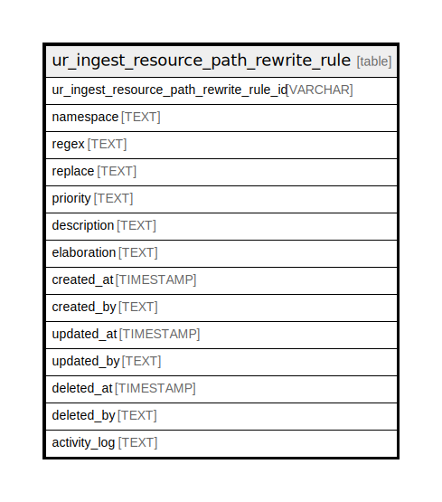

# ur_ingest_resource_path_rewrite_rule

## Description

A regular expression can determine whether certain paths should be  
rewritten before ur_ingest_resource_path_match_rule matches occur.

<details>
<summary><strong>Table Definition</strong></summary>

```sql
CREATE TABLE "ur_ingest_resource_path_rewrite_rule" (
    "ur_ingest_resource_path_rewrite_rule_id" VARCHAR PRIMARY KEY NOT NULL,
    "namespace" TEXT NOT NULL,
    "regex" TEXT NOT NULL,
    "replace" TEXT NOT NULL,
    "priority" TEXT,
    "description" TEXT,
    "elaboration" TEXT CHECK(json_valid(elaboration) OR elaboration IS NULL),
    "created_at" TIMESTAMP DEFAULT CURRENT_TIMESTAMP,
    "created_by" TEXT DEFAULT 'UNKNOWN',
    "updated_at" TIMESTAMP,
    "updated_by" TEXT,
    "deleted_at" TIMESTAMP,
    "deleted_by" TEXT,
    "activity_log" TEXT,
    UNIQUE("namespace", "regex", "replace")
)
```

</details>

## Columns

| Name                                    | Type      | Default           | Nullable | Comment                                                 |
| --------------------------------------- | --------- | ----------------- | -------- | ------------------------------------------------------- |
| ur_ingest_resource_path_rewrite_rule_id | VARCHAR   |                   | false    | {"isSqlDomainZodDescrMeta":true,"isVarChar":true}       |
| namespace                               | TEXT      |                   | false    |                                                         |
| regex                                   | TEXT      |                   | false    |                                                         |
| replace                                 | TEXT      |                   | false    |                                                         |
| priority                                | TEXT      |                   | true     |                                                         |
| description                             | TEXT      |                   | true     |                                                         |
| elaboration                             | TEXT      |                   | true     | {"isSqlDomainZodDescrMeta":true,"isJsonText":true}      |
| created_at                              | TIMESTAMP | CURRENT_TIMESTAMP | true     |                                                         |
| created_by                              | TEXT      | 'UNKNOWN'         | true     |                                                         |
| updated_at                              | TIMESTAMP |                   | true     |                                                         |
| updated_by                              | TEXT      |                   | true     |                                                         |
| deleted_at                              | TIMESTAMP |                   | true     |                                                         |
| deleted_by                              | TEXT      |                   | true     |                                                         |
| activity_log                            | TEXT      |                   | true     | {"isSqlDomainZodDescrMeta":true,"isJsonSqlDomain":true} |

## Constraints

| Name                                                    | Type        | Definition                                            |
| ------------------------------------------------------- | ----------- | ----------------------------------------------------- |
| ur_ingest_resource_path_rewrite_rule_id                 | PRIMARY KEY | PRIMARY KEY (ur_ingest_resource_path_rewrite_rule_id) |
| sqlite_autoindex_ur_ingest_resource_path_rewrite_rule_2 | UNIQUE      | UNIQUE (namespace, regex, replace)                    |
| sqlite_autoindex_ur_ingest_resource_path_rewrite_rule_1 | PRIMARY KEY | PRIMARY KEY (ur_ingest_resource_path_rewrite_rule_id) |
| -                                                       | CHECK       | CHECK(json_valid(elaboration) OR elaboration IS NULL) |

## Indexes

| Name                                                    | Definition                                            |
| ------------------------------------------------------- | ----------------------------------------------------- |
| sqlite_autoindex_ur_ingest_resource_path_rewrite_rule_2 | UNIQUE (namespace, regex, replace)                    |
| sqlite_autoindex_ur_ingest_resource_path_rewrite_rule_1 | PRIMARY KEY (ur_ingest_resource_path_rewrite_rule_id) |

## Relations



---

> Generated by [tbls](https://github.com/k1LoW/tbls)
