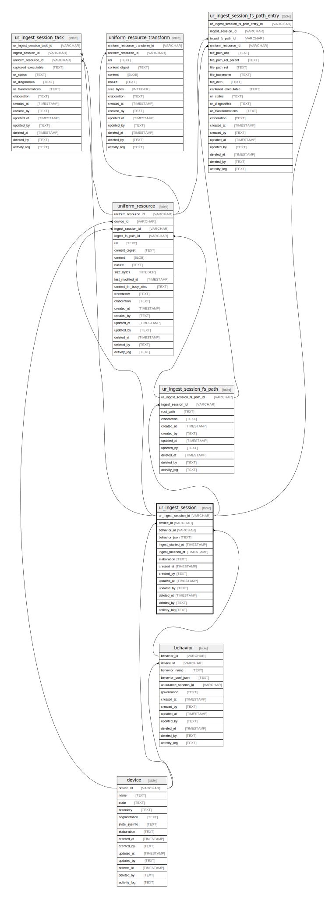

# ur_ingest_session

## Description

Immutable ingestion sessions represents any "discovery" or "walk" operation.  This could be a device file system scan or any other resource discovery  session. Each time a discovery operation starts, a record is created.  ur_ingest_session has a foreign key reference to the device table so that the  same device can be used for multiple ingest sessions but also the ingest  sessions can be merged across workstations / servers for easier detection  of changes and similaries between file systems on different devices.

<details>
<summary><strong>Table Definition</strong></summary>

```sql
CREATE TABLE "ur_ingest_session" (
    "ur_ingest_session_id" VARCHAR PRIMARY KEY NOT NULL,
    "device_id" VARCHAR NOT NULL,
    "behavior_id" VARCHAR,
    "behavior_json" TEXT CHECK(json_valid(behavior_json) OR behavior_json IS NULL),
    "ingest_started_at" TIMESTAMP NOT NULL,
    "ingest_finished_at" TIMESTAMP,
    "elaboration" TEXT CHECK(json_valid(elaboration) OR elaboration IS NULL),
    "created_at" TIMESTAMP DEFAULT CURRENT_TIMESTAMP,
    "created_by" TEXT DEFAULT 'UNKNOWN',
    "updated_at" TIMESTAMP,
    "updated_by" TEXT,
    "deleted_at" TIMESTAMP,
    "deleted_by" TEXT,
    "activity_log" TEXT,
    FOREIGN KEY("device_id") REFERENCES "device"("device_id"),
    FOREIGN KEY("behavior_id") REFERENCES "behavior"("behavior_id"),
    UNIQUE("device_id", "created_at")
)
```

</details>

## Columns

| Name                 | Type      | Default           | Nullable | Children                                                                                                                                                                | Parents                 | Comment                                                                   |
| -------------------- | --------- | ----------------- | -------- | ----------------------------------------------------------------------------------------------------------------------------------------------------------------------- | ----------------------- | ------------------------------------------------------------------------- |
| ur_ingest_session_id | VARCHAR   |                   | false    | [ur_ingest_session_fs_path](ur_ingest_session_fs_path.md) [uniform_resource](uniform_resource.md) [ur_ingest_session_fs_path_entry](ur_ingest_session_fs_path_entry.md) |                         | {"isSqlDomainZodDescrMeta":true,"isVarChar":true}                         |
| device_id            | VARCHAR   |                   | false    |                                                                                                                                                                         | [device](device.md)     | {"isSqlDomainZodDescrMeta":true,"isVarChar":true}                         |
| behavior_id          | VARCHAR   |                   | true     |                                                                                                                                                                         | [behavior](behavior.md) | {"isSqlDomainZodDescrMeta":true,"isVarChar":true}                         |
| behavior_json        | TEXT      |                   | true     |                                                                                                                                                                         |                         | {"isSqlDomainZodDescrMeta":true,"isJsonText":true}                        |
| ingest_started_at    | TIMESTAMP |                   | false    |                                                                                                                                                                         |                         | {"isSqlDomainZodDescrMeta":true,"isDateSqlDomain":true,"isDateTime":true} |
| ingest_finished_at   | TIMESTAMP |                   | true     |                                                                                                                                                                         |                         | {"isSqlDomainZodDescrMeta":true,"isDateSqlDomain":true,"isDateTime":true} |
| elaboration          | TEXT      |                   | true     |                                                                                                                                                                         |                         | {"isSqlDomainZodDescrMeta":true,"isJsonText":true}                        |
| created_at           | TIMESTAMP | CURRENT_TIMESTAMP | true     |                                                                                                                                                                         |                         |                                                                           |
| created_by           | TEXT      | 'UNKNOWN'         | true     |                                                                                                                                                                         |                         |                                                                           |
| updated_at           | TIMESTAMP |                   | true     |                                                                                                                                                                         |                         |                                                                           |
| updated_by           | TEXT      |                   | true     |                                                                                                                                                                         |                         |                                                                           |
| deleted_at           | TIMESTAMP |                   | true     |                                                                                                                                                                         |                         |                                                                           |
| deleted_by           | TEXT      |                   | true     |                                                                                                                                                                         |                         |                                                                           |
| activity_log         | TEXT      |                   | true     |                                                                                                                                                                         |                         | {"isSqlDomainZodDescrMeta":true,"isJsonSqlDomain":true}                   |

## Constraints

| Name                                 | Type        | Definition                                                                                                     |
| ------------------------------------ | ----------- | -------------------------------------------------------------------------------------------------------------- |
| ur_ingest_session_id                 | PRIMARY KEY | PRIMARY KEY (ur_ingest_session_id)                                                                             |
| - (Foreign key ID: 0)                | FOREIGN KEY | FOREIGN KEY (behavior_id) REFERENCES behavior (behavior_id) ON UPDATE NO ACTION ON DELETE NO ACTION MATCH NONE |
| - (Foreign key ID: 1)                | FOREIGN KEY | FOREIGN KEY (device_id) REFERENCES device (device_id) ON UPDATE NO ACTION ON DELETE NO ACTION MATCH NONE       |
| sqlite_autoindex_ur_ingest_session_2 | UNIQUE      | UNIQUE (device_id, created_at)                                                                                 |
| sqlite_autoindex_ur_ingest_session_1 | PRIMARY KEY | PRIMARY KEY (ur_ingest_session_id)                                                                             |
| -                                    | CHECK       | CHECK(json_valid(behavior_json) OR behavior_json IS NULL)                                                      |
| -                                    | CHECK       | CHECK(json_valid(elaboration) OR elaboration IS NULL)                                                          |

## Indexes

| Name                                 | Definition                         |
| ------------------------------------ | ---------------------------------- |
| sqlite_autoindex_ur_ingest_session_2 | UNIQUE (device_id, created_at)     |
| sqlite_autoindex_ur_ingest_session_1 | PRIMARY KEY (ur_ingest_session_id) |

## Relations



---

> Generated by [tbls](https://github.com/k1LoW/tbls)
