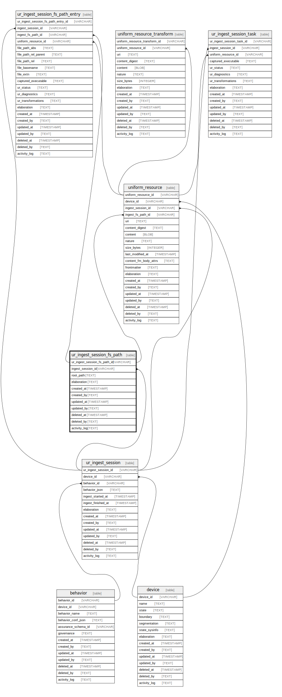

# ur_ingest_session_fs_path

## Description

Immutable ingest session file system path represents a discovery or "walk" path. If  the session included a file system scan, then root_path is the  root file system path that was scanned. If the session was discovering  resources in another target then root_path would be  representative of the target path (could be a URI).

<details>
<summary><strong>Table Definition</strong></summary>

```sql
CREATE TABLE "ur_ingest_session_fs_path" (
    "ur_ingest_session_fs_path_id" ULID PRIMARY KEY NOT NULL,
    "ingest_session_id" ULID NOT NULL,
    "root_path" TEXT NOT NULL,
    "elaboration" TEXT CHECK(json_valid(elaboration) OR elaboration IS NULL),
    "created_at" TIMESTAMP DEFAULT CURRENT_TIMESTAMP,
    "created_by" TEXT DEFAULT 'UNKNOWN',
    "updated_at" TIMESTAMP,
    "updated_by" TEXT,
    "deleted_at" TIMESTAMP,
    "deleted_by" TEXT,
    "activity_log" TEXT,
    FOREIGN KEY("ingest_session_id") REFERENCES "ur_ingest_session"("ur_ingest_session_id"),
    UNIQUE("ingest_session_id", "root_path", "created_at")
)
```

</details>

## Columns

| Name                         | Type      | Default           | Nullable | Children                                                                                                      | Parents                                   | Comment                                                 |
| ---------------------------- | --------- | ----------------- | -------- | ------------------------------------------------------------------------------------------------------------- | ----------------------------------------- | ------------------------------------------------------- |
| ur_ingest_session_fs_path_id | ULID      |                   | false    | [uniform_resource](uniform_resource.md) [ur_ingest_session_fs_path_entry](ur_ingest_session_fs_path_entry.md) |                                           | {"isSqlDomainZodDescrMeta":true,"isUlid":true}          |
| ingest_session_id            | ULID      |                   | false    |                                                                                                               | [ur_ingest_session](ur_ingest_session.md) | {"isSqlDomainZodDescrMeta":true,"isUlid":true}          |
| root_path                    | TEXT      |                   | false    |                                                                                                               |                                           |                                                         |
| elaboration                  | TEXT      |                   | true     |                                                                                                               |                                           | {"isSqlDomainZodDescrMeta":true,"isJsonText":true}      |
| created_at                   | TIMESTAMP | CURRENT_TIMESTAMP | true     |                                                                                                               |                                           |                                                         |
| created_by                   | TEXT      | 'UNKNOWN'         | true     |                                                                                                               |                                           |                                                         |
| updated_at                   | TIMESTAMP |                   | true     |                                                                                                               |                                           |                                                         |
| updated_by                   | TEXT      |                   | true     |                                                                                                               |                                           |                                                         |
| deleted_at                   | TIMESTAMP |                   | true     |                                                                                                               |                                           |                                                         |
| deleted_by                   | TEXT      |                   | true     |                                                                                                               |                                           |                                                         |
| activity_log                 | TEXT      |                   | true     |                                                                                                               |                                           | {"isSqlDomainZodDescrMeta":true,"isJsonSqlDomain":true} |

## Constraints

| Name                                         | Type        | Definition                                                                                                                             |
| -------------------------------------------- | ----------- | -------------------------------------------------------------------------------------------------------------------------------------- |
| ur_ingest_session_fs_path_id                 | PRIMARY KEY | PRIMARY KEY (ur_ingest_session_fs_path_id)                                                                                             |
| - (Foreign key ID: 0)                        | FOREIGN KEY | FOREIGN KEY (ingest_session_id) REFERENCES ur_ingest_session (ur_ingest_session_id) ON UPDATE NO ACTION ON DELETE NO ACTION MATCH NONE |
| sqlite_autoindex_ur_ingest_session_fs_path_2 | UNIQUE      | UNIQUE (ingest_session_id, root_path, created_at)                                                                                      |
| sqlite_autoindex_ur_ingest_session_fs_path_1 | PRIMARY KEY | PRIMARY KEY (ur_ingest_session_fs_path_id)                                                                                             |
| -                                            | CHECK       | CHECK(json_valid(elaboration) OR elaboration IS NULL)                                                                                  |

## Indexes

| Name                                                        | Definition                                                                                                                                  |
| ----------------------------------------------------------- | ------------------------------------------------------------------------------------------------------------------------------------------- |
| idx_ur_ingest_session_fs_path__ingest_session_id__root_path | CREATE INDEX "idx_ur_ingest_session_fs_path__ingest_session_id__root_path" ON "ur_ingest_session_fs_path"("ingest_session_id", "root_path") |
| sqlite_autoindex_ur_ingest_session_fs_path_2                | UNIQUE (ingest_session_id, root_path, created_at)                                                                                           |
| sqlite_autoindex_ur_ingest_session_fs_path_1                | PRIMARY KEY (ur_ingest_session_fs_path_id)                                                                                                  |

## Relations



---

> Generated by [tbls](https://github.com/k1LoW/tbls)
