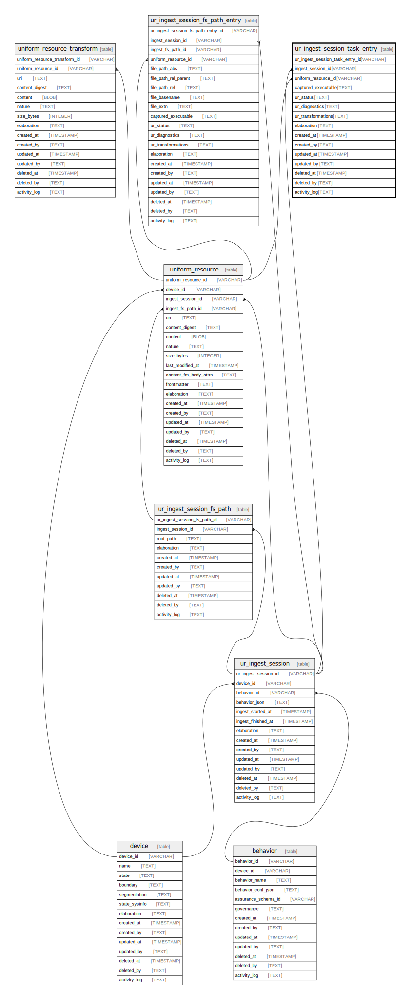

# ur_ingest_session_task_entry

## Description

Contains entries related to task content ingestion paths. On multiple executions,  unlike uniform_resource, ur_ingest_session_task_entry rows are always inserted and  references the uniform_resource primary key of its related content.  This method allows for a more efficient query of file version differences across  sessions. With SQL queries, you can detect which sessions have a file added or modified,  which sessions have a file deleted, and what the differences are in file contents  if they were modified across sessions.

<details>
<summary><strong>Table Definition</strong></summary>

```sql
CREATE TABLE "ur_ingest_session_task_entry" (
    "ur_ingest_session_task_entry_id" VARCHAR PRIMARY KEY NOT NULL,
    "ingest_session_id" VARCHAR NOT NULL,
    "uniform_resource_id" VARCHAR,
    "captured_executable" TEXT CHECK(json_valid(captured_executable)) NOT NULL,
    "ur_status" TEXT,
    "ur_diagnostics" TEXT CHECK(json_valid(ur_diagnostics) OR ur_diagnostics IS NULL),
    "ur_transformations" TEXT CHECK(json_valid(ur_transformations) OR ur_transformations IS NULL),
    "elaboration" TEXT CHECK(json_valid(elaboration) OR elaboration IS NULL),
    "created_at" TIMESTAMP DEFAULT CURRENT_TIMESTAMP,
    "created_by" TEXT DEFAULT 'UNKNOWN',
    "updated_at" TIMESTAMP,
    "updated_by" TEXT,
    "deleted_at" TIMESTAMP,
    "deleted_by" TEXT,
    "activity_log" TEXT,
    FOREIGN KEY("ingest_session_id") REFERENCES "ur_ingest_session"("ur_ingest_session_id"),
    FOREIGN KEY("uniform_resource_id") REFERENCES "uniform_resource"("uniform_resource_id")
)
```

</details>

## Columns

| Name                            | Type      | Default           | Nullable | Parents                                   | Comment                                                 |
| ------------------------------- | --------- | ----------------- | -------- | ----------------------------------------- | ------------------------------------------------------- |
| ur_ingest_session_task_entry_id | VARCHAR   |                   | false    |                                           | {"isSqlDomainZodDescrMeta":true,"isVarChar":true}       |
| ingest_session_id               | VARCHAR   |                   | false    | [ur_ingest_session](ur_ingest_session.md) | {"isSqlDomainZodDescrMeta":true,"isVarChar":true}       |
| uniform_resource_id             | VARCHAR   |                   | true     | [uniform_resource](uniform_resource.md)   | {"isSqlDomainZodDescrMeta":true,"isVarChar":true}       |
| captured_executable             | TEXT      |                   | false    |                                           | {"isSqlDomainZodDescrMeta":true,"isJsonText":true}      |
| ur_status                       | TEXT      |                   | true     |                                           |                                                         |
| ur_diagnostics                  | TEXT      |                   | true     |                                           | {"isSqlDomainZodDescrMeta":true,"isJsonText":true}      |
| ur_transformations              | TEXT      |                   | true     |                                           | {"isSqlDomainZodDescrMeta":true,"isJsonText":true}      |
| elaboration                     | TEXT      |                   | true     |                                           | {"isSqlDomainZodDescrMeta":true,"isJsonText":true}      |
| created_at                      | TIMESTAMP | CURRENT_TIMESTAMP | true     |                                           |                                                         |
| created_by                      | TEXT      | 'UNKNOWN'         | true     |                                           |                                                         |
| updated_at                      | TIMESTAMP |                   | true     |                                           |                                                         |
| updated_by                      | TEXT      |                   | true     |                                           |                                                         |
| deleted_at                      | TIMESTAMP |                   | true     |                                           |                                                         |
| deleted_by                      | TEXT      |                   | true     |                                           |                                                         |
| activity_log                    | TEXT      |                   | true     |                                           | {"isSqlDomainZodDescrMeta":true,"isJsonSqlDomain":true} |

## Constraints

| Name                                            | Type        | Definition                                                                                                                             |
| ----------------------------------------------- | ----------- | -------------------------------------------------------------------------------------------------------------------------------------- |
| ur_ingest_session_task_entry_id                 | PRIMARY KEY | PRIMARY KEY (ur_ingest_session_task_entry_id)                                                                                          |
| - (Foreign key ID: 0)                           | FOREIGN KEY | FOREIGN KEY (uniform_resource_id) REFERENCES uniform_resource (uniform_resource_id) ON UPDATE NO ACTION ON DELETE NO ACTION MATCH NONE |
| - (Foreign key ID: 1)                           | FOREIGN KEY | FOREIGN KEY (ingest_session_id) REFERENCES ur_ingest_session (ur_ingest_session_id) ON UPDATE NO ACTION ON DELETE NO ACTION MATCH NONE |
| sqlite_autoindex_ur_ingest_session_task_entry_1 | PRIMARY KEY | PRIMARY KEY (ur_ingest_session_task_entry_id)                                                                                          |
| -                                               | CHECK       | CHECK(json_valid(captured_executable))                                                                                                 |
| -                                               | CHECK       | CHECK(json_valid(ur_diagnostics) OR ur_diagnostics IS NULL)                                                                            |
| -                                               | CHECK       | CHECK(json_valid(ur_transformations) OR ur_transformations IS NULL)                                                                    |
| -                                               | CHECK       | CHECK(json_valid(elaboration) OR elaboration IS NULL)                                                                                  |

## Indexes

| Name                                                | Definition                                                                                                                |
| --------------------------------------------------- | ------------------------------------------------------------------------------------------------------------------------- |
| idx_ur_ingest_session_task_entry__ingest_session_id | CREATE INDEX "idx_ur_ingest_session_task_entry__ingest_session_id" ON "ur_ingest_session_task_entry"("ingest_session_id") |
| sqlite_autoindex_ur_ingest_session_task_entry_1     | PRIMARY KEY (ur_ingest_session_task_entry_id)                                                                             |

## Relations



---

> Generated by [tbls](https://github.com/k1LoW/tbls)
