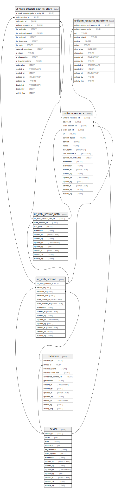

# ur_walk_session

## Description

<details>
<summary><strong>Table Definition</strong></summary>

```sql
CREATE TABLE "ur_walk_session" (
    "ur_walk_session_id" ULID PRIMARY KEY NOT NULL,
    "device_id" ULID NOT NULL,
    "walk_started_at" TIMESTAMP NOT NULL,
    "walk_finished_at" TIMESTAMP,
    "ignore_paths_regex" TEXT,
    "blobs_regex" TEXT,
    "digests_regex" TEXT,
    "elaboration" TEXT CHECK(json_valid(elaboration) OR elaboration IS NULL),
    "created_at" TIMESTAMP DEFAULT CURRENT_TIMESTAMP,
    "created_by" TEXT DEFAULT 'UNKNOWN',
    "updated_at" TIMESTAMP,
    "updated_by" TEXT,
    "deleted_at" TIMESTAMP,
    "deleted_by" TEXT,
    "activity_log" TEXT,
    FOREIGN KEY("device_id") REFERENCES "device"("device_id"),
    UNIQUE("device_id", "created_at")
)
```

</details>

## Columns

| Name               | Type      | Default           | Nullable | Children                                                                                                                                                  | Parents             | Comment                                                                   |
| ------------------ | --------- | ----------------- | -------- | --------------------------------------------------------------------------------------------------------------------------------------------------------- | ------------------- | ------------------------------------------------------------------------- |
| ur_walk_session_id | ULID      |                   | false    | [ur_walk_session_path](ur_walk_session_path.md) [uniform_resource](uniform_resource.md) [ur_walk_session_path_fs_entry](ur_walk_session_path_fs_entry.md) |                     | {"isSqlDomainZodDescrMeta":true,"isUlid":true}                            |
| device_id          | ULID      |                   | false    |                                                                                                                                                           | [device](device.md) | {"isSqlDomainZodDescrMeta":true,"isUlid":true}                            |
| walk_started_at    | TIMESTAMP |                   | false    |                                                                                                                                                           |                     | {"isSqlDomainZodDescrMeta":true,"isDateSqlDomain":true,"isDateTime":true} |
| walk_finished_at   | TIMESTAMP |                   | true     |                                                                                                                                                           |                     | {"isSqlDomainZodDescrMeta":true,"isDateSqlDomain":true,"isDateTime":true} |
| ignore_paths_regex | TEXT      |                   | true     |                                                                                                                                                           |                     |                                                                           |
| blobs_regex        | TEXT      |                   | true     |                                                                                                                                                           |                     |                                                                           |
| digests_regex      | TEXT      |                   | true     |                                                                                                                                                           |                     |                                                                           |
| elaboration        | TEXT      |                   | true     |                                                                                                                                                           |                     | {"isSqlDomainZodDescrMeta":true,"isJsonText":true}                        |
| created_at         | TIMESTAMP | CURRENT_TIMESTAMP | true     |                                                                                                                                                           |                     |                                                                           |
| created_by         | TEXT      | 'UNKNOWN'         | true     |                                                                                                                                                           |                     |                                                                           |
| updated_at         | TIMESTAMP |                   | true     |                                                                                                                                                           |                     |                                                                           |
| updated_by         | TEXT      |                   | true     |                                                                                                                                                           |                     |                                                                           |
| deleted_at         | TIMESTAMP |                   | true     |                                                                                                                                                           |                     |                                                                           |
| deleted_by         | TEXT      |                   | true     |                                                                                                                                                           |                     |                                                                           |
| activity_log       | TEXT      |                   | true     |                                                                                                                                                           |                     | {"isSqlDomainZodDescrMeta":true,"isJsonSqlDomain":true}                   |

## Constraints

| Name                               | Type        | Definition                                                                                               |
| ---------------------------------- | ----------- | -------------------------------------------------------------------------------------------------------- |
| ur_walk_session_id                 | PRIMARY KEY | PRIMARY KEY (ur_walk_session_id)                                                                         |
| - (Foreign key ID: 0)              | FOREIGN KEY | FOREIGN KEY (device_id) REFERENCES device (device_id) ON UPDATE NO ACTION ON DELETE NO ACTION MATCH NONE |
| sqlite_autoindex_ur_walk_session_2 | UNIQUE      | UNIQUE (device_id, created_at)                                                                           |
| sqlite_autoindex_ur_walk_session_1 | PRIMARY KEY | PRIMARY KEY (ur_walk_session_id)                                                                         |
| -                                  | CHECK       | CHECK(json_valid(elaboration) OR elaboration IS NULL)                                                    |

## Indexes

| Name                               | Definition                       |
| ---------------------------------- | -------------------------------- |
| sqlite_autoindex_ur_walk_session_2 | UNIQUE (device_id, created_at)   |
| sqlite_autoindex_ur_walk_session_1 | PRIMARY KEY (ur_walk_session_id) |

## Relations



---

> Generated by [tbls](https://github.com/k1LoW/tbls)
