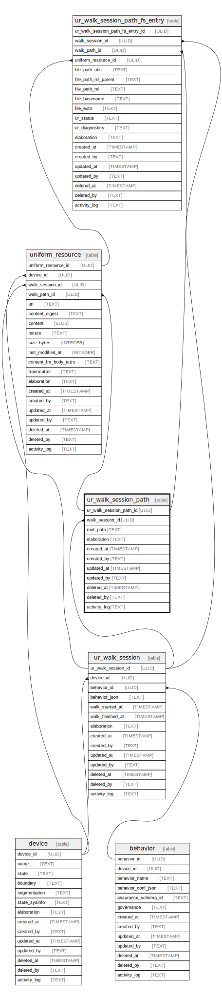

# ur_walk_session_path

## Description

Stores file system content walk paths associated with a particular  
session and may have one or more root paths per session.

<details>
<summary><strong>Table Definition</strong></summary>

```sql
CREATE TABLE "ur_walk_session_path" (
    "ur_walk_session_path_id" ULID PRIMARY KEY NOT NULL,
    "walk_session_id" ULID NOT NULL,
    "root_path" TEXT NOT NULL,
    "elaboration" TEXT CHECK(json_valid(elaboration) OR elaboration IS NULL),
    "created_at" TIMESTAMP DEFAULT CURRENT_TIMESTAMP,
    "created_by" TEXT DEFAULT 'UNKNOWN',
    "updated_at" TIMESTAMP,
    "updated_by" TEXT,
    "deleted_at" TIMESTAMP,
    "deleted_by" TEXT,
    "activity_log" TEXT,
    FOREIGN KEY("walk_session_id") REFERENCES "ur_walk_session"("ur_walk_session_id"),
    UNIQUE("walk_session_id", "root_path", "created_at")
)
```

</details>

## Columns

| Name                    | Type      | Default           | Nullable | Children                                                                                                  | Parents                               | Comment                                                 |
| ----------------------- | --------- | ----------------- | -------- | --------------------------------------------------------------------------------------------------------- | ------------------------------------- | ------------------------------------------------------- |
| ur_walk_session_path_id | ULID      |                   | false    | [uniform_resource](uniform_resource.md) [ur_walk_session_path_fs_entry](ur_walk_session_path_fs_entry.md) |                                       | {"isSqlDomainZodDescrMeta":true,"isUlid":true}          |
| walk_session_id         | ULID      |                   | false    |                                                                                                           | [ur_walk_session](ur_walk_session.md) | {"isSqlDomainZodDescrMeta":true,"isUlid":true}          |
| root_path               | TEXT      |                   | false    |                                                                                                           |                                       |                                                         |
| elaboration             | TEXT      |                   | true     |                                                                                                           |                                       | {"isSqlDomainZodDescrMeta":true,"isJsonText":true}      |
| created_at              | TIMESTAMP | CURRENT_TIMESTAMP | true     |                                                                                                           |                                       |                                                         |
| created_by              | TEXT      | 'UNKNOWN'         | true     |                                                                                                           |                                       |                                                         |
| updated_at              | TIMESTAMP |                   | true     |                                                                                                           |                                       |                                                         |
| updated_by              | TEXT      |                   | true     |                                                                                                           |                                       |                                                         |
| deleted_at              | TIMESTAMP |                   | true     |                                                                                                           |                                       |                                                         |
| deleted_by              | TEXT      |                   | true     |                                                                                                           |                                       |                                                         |
| activity_log            | TEXT      |                   | true     |                                                                                                           |                                       | {"isSqlDomainZodDescrMeta":true,"isJsonSqlDomain":true} |

## Constraints

| Name                                    | Type        | Definition                                                                                                                       |
| --------------------------------------- | ----------- | -------------------------------------------------------------------------------------------------------------------------------- |
| ur_walk_session_path_id                 | PRIMARY KEY | PRIMARY KEY (ur_walk_session_path_id)                                                                                            |
| - (Foreign key ID: 0)                   | FOREIGN KEY | FOREIGN KEY (walk_session_id) REFERENCES ur_walk_session (ur_walk_session_id) ON UPDATE NO ACTION ON DELETE NO ACTION MATCH NONE |
| sqlite_autoindex_ur_walk_session_path_2 | UNIQUE      | UNIQUE (walk_session_id, root_path, created_at)                                                                                  |
| sqlite_autoindex_ur_walk_session_path_1 | PRIMARY KEY | PRIMARY KEY (ur_walk_session_path_id)                                                                                            |
| -                                       | CHECK       | CHECK(json_valid(elaboration) OR elaboration IS NULL)                                                                            |

## Indexes

| Name                                                 | Definition                                                                                                                    |
| ---------------------------------------------------- | ----------------------------------------------------------------------------------------------------------------------------- |
| idx_ur_walk_session_path__walk_session_id__root_path | CREATE INDEX "idx_ur_walk_session_path__walk_session_id__root_path" ON "ur_walk_session_path"("walk_session_id", "root_path") |
| sqlite_autoindex_ur_walk_session_path_2              | UNIQUE (walk_session_id, root_path, created_at)                                                                               |
| sqlite_autoindex_ur_walk_session_path_1              | PRIMARY KEY (ur_walk_session_path_id)                                                                                         |

## Relations



---

> Generated by [tbls](https://github.com/k1LoW/tbls)
