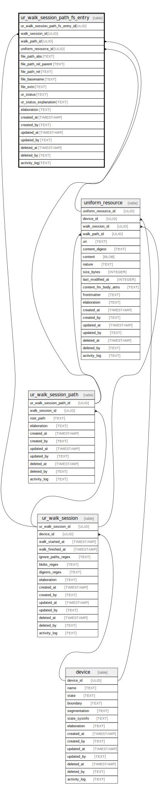

# ur_walk_session_path_fs_entry

## Description

Contains entries related to file system content walk paths. On multiple executions,  unlike uniform_resource, ur_walk_session_path_fs_entry rows are always inserted and   references the uniform_resource primary key of its related content.  This method allows for a more efficient query of file version differences across  sessions. With SQL queries, you can detect which sessions have a file added or modified,   which sessions have a file deleted, and what the differences are in file contents  if they were modified across sessions.

<details>
<summary><strong>Table Definition</strong></summary>

```sql
CREATE TABLE "ur_walk_session_path_fs_entry" (
    "ur_walk_session_path_fs_entry_id" ULID PRIMARY KEY NOT NULL,
    "walk_session_id" ULID NOT NULL,
    "walk_path_id" ULID NOT NULL,
    "uniform_resource_id" ULID,
    "file_path_abs" TEXT NOT NULL,
    "file_path_rel_parent" TEXT NOT NULL,
    "file_path_rel" TEXT NOT NULL,
    "file_basename" TEXT NOT NULL,
    "file_extn" TEXT,
    "elaboration" TEXT CHECK(json_valid(elaboration) OR elaboration IS NULL),
    "created_at" TIMESTAMP DEFAULT CURRENT_TIMESTAMP,
    "created_by" TEXT DEFAULT 'UNKNOWN',
    "updated_at" TIMESTAMP,
    "updated_by" TEXT,
    "deleted_at" TIMESTAMP,
    "deleted_by" TEXT,
    "activity_log" TEXT,
    FOREIGN KEY("walk_session_id") REFERENCES "ur_walk_session"("ur_walk_session_id"),
    FOREIGN KEY("walk_path_id") REFERENCES "ur_walk_session_path"("ur_walk_session_path_id"),
    FOREIGN KEY("uniform_resource_id") REFERENCES "uniform_resource"("uniform_resource_id")
)
```

</details>

## Columns

| Name                             | Type      | Default           | Nullable | Parents                                         | Comment                                                 |
| -------------------------------- | --------- | ----------------- | -------- | ----------------------------------------------- | ------------------------------------------------------- |
| ur_walk_session_path_fs_entry_id | ULID      |                   | false    |                                                 | {"isSqlDomainZodDescrMeta":true,"isUlid":true}          |
| walk_session_id                  | ULID      |                   | false    | [ur_walk_session](ur_walk_session.md)           | {"isSqlDomainZodDescrMeta":true,"isUlid":true}          |
| walk_path_id                     | ULID      |                   | false    | [ur_walk_session_path](ur_walk_session_path.md) | {"isSqlDomainZodDescrMeta":true,"isUlid":true}          |
| uniform_resource_id              | ULID      |                   | true     | [uniform_resource](uniform_resource.md)         | {"isSqlDomainZodDescrMeta":true,"isUlid":true}          |
| file_path_abs                    | TEXT      |                   | false    |                                                 |                                                         |
| file_path_rel_parent             | TEXT      |                   | false    |                                                 |                                                         |
| file_path_rel                    | TEXT      |                   | false    |                                                 |                                                         |
| file_basename                    | TEXT      |                   | false    |                                                 |                                                         |
| file_extn                        | TEXT      |                   | true     |                                                 |                                                         |
| elaboration                      | TEXT      |                   | true     |                                                 | {"isSqlDomainZodDescrMeta":true,"isJsonText":true}      |
| created_at                       | TIMESTAMP | CURRENT_TIMESTAMP | true     |                                                 |                                                         |
| created_by                       | TEXT      | 'UNKNOWN'         | true     |                                                 |                                                         |
| updated_at                       | TIMESTAMP |                   | true     |                                                 |                                                         |
| updated_by                       | TEXT      |                   | true     |                                                 |                                                         |
| deleted_at                       | TIMESTAMP |                   | true     |                                                 |                                                         |
| deleted_by                       | TEXT      |                   | true     |                                                 |                                                         |
| activity_log                     | TEXT      |                   | true     |                                                 | {"isSqlDomainZodDescrMeta":true,"isJsonSqlDomain":true} |

## Constraints

| Name                                             | Type        | Definition                                                                                                                              |
| ------------------------------------------------ | ----------- | --------------------------------------------------------------------------------------------------------------------------------------- |
| ur_walk_session_path_fs_entry_id                 | PRIMARY KEY | PRIMARY KEY (ur_walk_session_path_fs_entry_id)                                                                                          |
| - (Foreign key ID: 0)                            | FOREIGN KEY | FOREIGN KEY (uniform_resource_id) REFERENCES uniform_resource (uniform_resource_id) ON UPDATE NO ACTION ON DELETE NO ACTION MATCH NONE  |
| - (Foreign key ID: 1)                            | FOREIGN KEY | FOREIGN KEY (walk_path_id) REFERENCES ur_walk_session_path (ur_walk_session_path_id) ON UPDATE NO ACTION ON DELETE NO ACTION MATCH NONE |
| - (Foreign key ID: 2)                            | FOREIGN KEY | FOREIGN KEY (walk_session_id) REFERENCES ur_walk_session (ur_walk_session_id) ON UPDATE NO ACTION ON DELETE NO ACTION MATCH NONE        |
| sqlite_autoindex_ur_walk_session_path_fs_entry_1 | PRIMARY KEY | PRIMARY KEY (ur_walk_session_path_fs_entry_id)                                                                                          |
| -                                                | CHECK       | CHECK(json_valid(elaboration) OR elaboration IS NULL)                                                                                   |

## Indexes

| Name                                                              | Definition                                                                                                                                              |
| ----------------------------------------------------------------- | ------------------------------------------------------------------------------------------------------------------------------------------------------- |
| idx_ur_walk_session_path_fs_entry__walk_session_id__file_path_abs | CREATE INDEX "idx_ur_walk_session_path_fs_entry__walk_session_id__file_path_abs" ON "ur_walk_session_path_fs_entry"("walk_session_id", "file_path_abs") |
| sqlite_autoindex_ur_walk_session_path_fs_entry_1                  | PRIMARY KEY (ur_walk_session_path_fs_entry_id)                                                                                                          |

## Relations



---

> Generated by [tbls](https://github.com/k1LoW/tbls)
